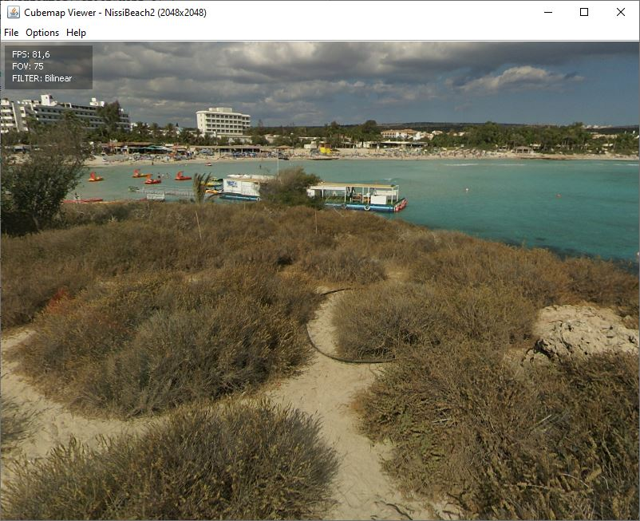
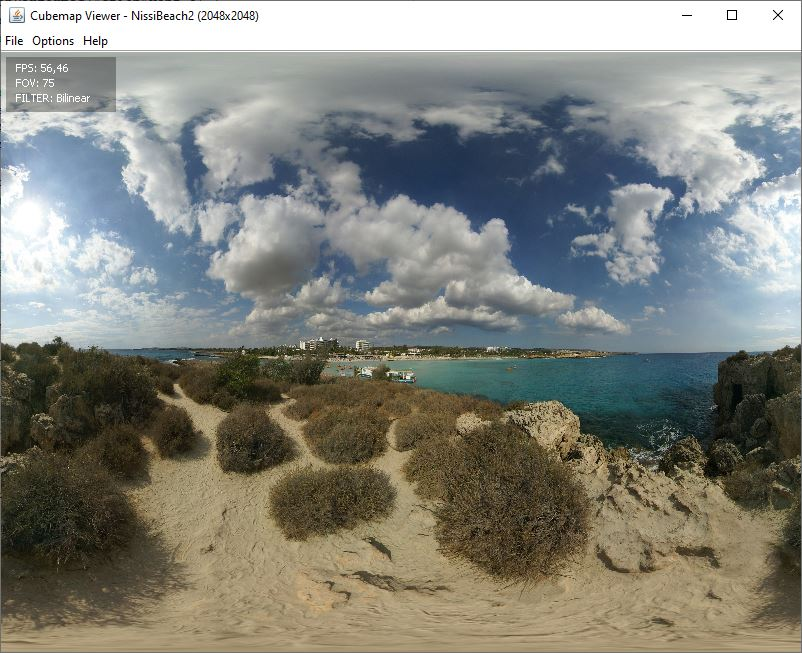
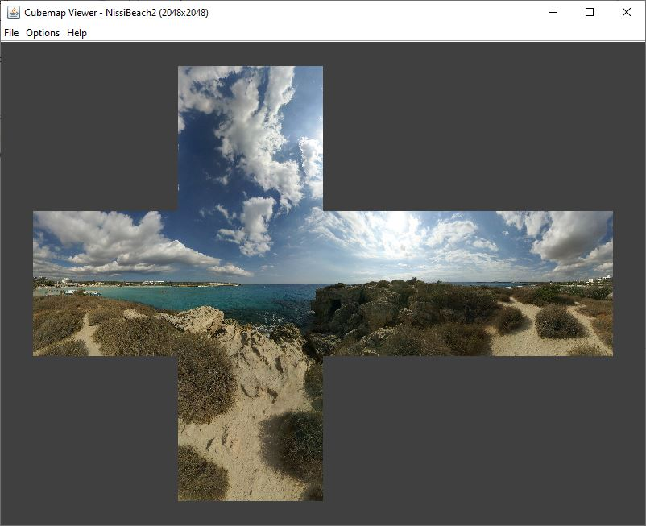

# cubemap-viewer
A cubemap viewer written in Java. All the rendering is done in software.
#### Perspective Mode:

#### Equirectangular Mode:

#### Unwrapped Mode:

#### Cubemap convention
Left-handed coordinate system.
#### File name convention
The files names need to be: posx, negx, posy, negy, posz, negz or alternatively: right, left, top, bottom, front, back.
#### Image format support
JPEG, PNG, BMP
#### Where to find cubemaps ?
Emil Persson has really nice cubemaps in his site: http://www.humus.name/index.php?page=Textures
#### Controls
- Rotate camera: Click and drag
- Zoom: Scroll wheel
- Toggle reference: R
- Toggle info (fps, fov, filter): I
- Reset camera orientation: Space
